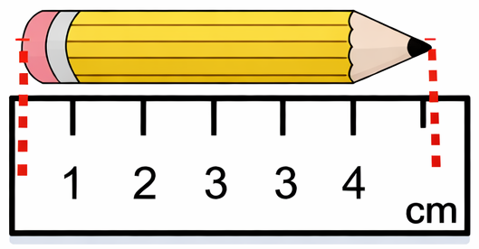
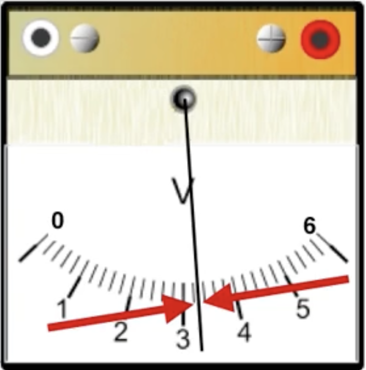
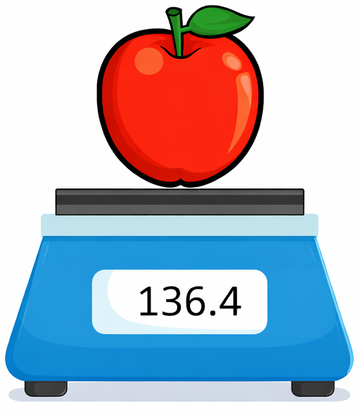

# Onzekerheden {#sec-onzekerheden} 

In de wiskunde werken we meestal met exacte waarden en exacte uitkomsten. In de experimentele wetenschap is dat anders: metingen in de echte wereld zijn nooit exact. Elke meting heeft een beperkte nauwkeurigheid en dus een bijhorende onzekerheid.

Dat maakt onderzoek niet alleen realistischer, maar ook moeilijker. Het bepalen, noteren en correct verwerken van onzekerheden is een essentieel onderdeel van experimenteel werk, maar wordt vaak vergeten of onderschat. Toch zijn onzekerheden nodig om resultaten correct te interpreteren, met elkaar te vergelijken en betrouwbare conclusies te trekken.

::: {.callout-caution title="Onzekerheid is niet hetzelfde als een fout"}
Een **fout** is een vergissing, bijvoorbeeld een verkeerde aflezing of een rekenfout.  

Een **onzekerheid** hoort bij elke meting, ook wanneer er geen vergissing gemaakt is. Ze geeft aan binnen welk interval de werkelijke waarde waarschijnlijk ligt.
:::

Het gevolg is dat resultaten uit experimenten geen vaste getallen zijn, maar **intervallen van mogelijke waarden**. Het correct omgaan met deze onzekerheden is essentieel om:

- de kwaliteit van metingen te beoordelen;
- resultaten op een eerlijke manier te vergelijken;
- betrouwbare conclusies te trekken uit data.

Wanneer gemeten grootheden verder gebruikt worden in berekeningen, moeten de bijhorende onzekerheden ook meegenomen worden. Dit proces heet het **propageren van onzekerheden**.

::: {.callout-warning title="Belangrijk inzicht"}
Het omgaan met onzekerheden is één van de moeilijkste en vaak vergeten onderdelen van experimenteel werk. 
Fouten in dit proces leiden tot onnauwkeurige resultaten en kunnen volledig verkeerde conclusies veroorzaken.
:::

::: {.callout-note title="Space Shuttle Challenger (1996)" collapse="true"}
Een bekend voorbeeld is de ramp met de [**Space Shuttle Challenger (1986)**](https://nl.wikipedia.org/wiki/Challenger_(ruimteveer)).

Bij deze lancering faalden de zogenaamde **O-ringen** in de vaste brandstofraketten. Deze rubberen afdichtingen waren gevoelig voor temperatuur, maar:

- de invloed van lage temperatuur op het materiaalgedrag was **onvoldoende gekwantificeerd**;
- de beschikbare meetgegevens bevatten **onzekerheden en spreiding**, maar die werden niet correct geïnterpreteerd;
- de risico-inschatting hield onvoldoende rekening met deze onzekerheden.

Het gevolg:

- de afdichting faalde kort na de lancering;
- brandstof ontsnapte en leidde tot een explosie;
- de shuttle werd vernietigd en de bemanning kwam om het leven.

Dit voorbeeld toont aan dat het **onderschatten of verkeerd interpreteren van onzekerheden in meetgegevens** ernstige gevolgen kan hebben.
:::

::: {.callout-note title="Mars Climate Orbiter (1999)" collapse="true"}
Een ander voorbeeld is de mislukking van de [**Mars Climate Orbiter (1999)**](https://nl.wikipedia.org/wiki/Mars_Climate_Orbiter).

Bij deze missie werd een fout gemaakt in de verwerking van meetgegevens:

- één team gebruikte **imperiale eenheden** (pond-seconde);
- een ander team verwachtte **SI-eenheden** (newton-seconde).

Deze inconsistentie werd niet correct opgevangen in de berekeningen en leidde tot foutieve invoer in het navigatiemodel. Het gevolg:

- de sonde kwam te laag in de atmosfeer van Mars;
- de missie ging verloren.

Dit toont aan dat kleine fouten in metingen en hun verwerking — inclusief onzekerheden en eenheden — **grote gevolgen kunnen hebben**.
:::

## Notatie en bereik

Een meting levert geen exacte waarde, maar een **interval van mogelijke waarden**.

We noteren een meetresultaat als:

$$
x \pm \Delta x
$$

met

- $x$ de gemeten waarde;
- $\Delta x$ de absolute onzekerheid.

Het bijhorende **bereik** schrijven we als interval:

$$
[x_\text{min}, x_\text{max}] = [x - \Delta x,\; x + \Delta x]
$$

Dit interval geeft alle mogelijke waarden van de grootheid.

::: {.callout-note title="Voorbeeld"}
Gegeven:
$$
5 \pm 3
$$

Bereik:
$$
[2,\; 8]
$$

Alle waarden tussen 2 en 8 zijn mogelijk, zoals weergegeven in @fig-onzekerheid. 

::: {#fig-onzekerheid fig-cap="Intervalvoorstelling van $x \pm \Delta x$ op de getallenas voor $5 \pm 3$." fig-align="center" fig-cap-align="center"}
```{tikz}
\large
\begin{tikzpicture}[scale=1.5]

    % As
    \draw[->, thick] (0,0) -- (10.5,0);
    \node[below right] at (10.5,0) {$x$};

    % Ticks
    \foreach \x in {0,...,10} {
        \draw (\x,-0.15) -- (\x,0.15);
        \node[below] at (\x,-0.15) {\x};
    }

    \draw[line width=3pt, cyan] (2,0) -- (8,0);

    \draw[dashed] (2,-.5) -- (2,-1);
    \draw[dashed] (8,-.5) -- (8,-1);

    \draw[fill=cyan, thick] (2,0) circle (3pt)
        node [above=1em] {$x - \Delta x$}
        node [below=2em] {$x_{\min}$};
    \draw[fill=cyan, thick] (8,0) circle (3pt)
        node [above=1em] {$x + \Delta x$}
        node [below=2em] {$x_{\max}$};

    \draw[fill=orange, thick] (5,0) circle (4.5pt)
        node [above=1em] {$x$};

    \draw[<->] (2,-1) -- (8,-1)
        node[midway, below] {$2\Delta x$};

\end{tikzpicture}
```
:::
:::

::: {.callout-tip title="Inzicht"}
Bij een notatie van de vorm
$$
x \pm \Delta x
$$

geldt:

- $x$ is het **midden van het interval** (het gemiddelde van de grenswaarden);
- $\Delta x$ is de **helft van de spreiding** van het interval.

Wiskundig:

$$
x = \frac{\text{max} + \text{min}}{2}
\qquad
\Delta x = \frac{\text{max} - \text{min}}{2}
$$
:::

## Bepalen van meetonzekerheid

Meetonzekerheid ontstaat door de beperkte nauwkeurigheid van meetinstrumenten. Elk meetinstrument heeft een eindige resolutie en veroorzaakt dus een spreiding in mogelijke waarden.

### Basisregel analoge metingen

Voor analoge metingen wordt de onzekerheid $\Delta x$ bepaald als de grootste van twee schattingen:

1. **Instrumentlimiet**

   De helft van de kleinste schaalverdeling, vermenigvuldigd met het aantal metingen:

   $$
   \Delta x = n \frac{\delta}{2}
   $$

   met

   - $\delta$ de kleinste schaalverdeling  
   - $n$ het aantal metingen  

2. **Schatting van de experimentator**

   Een inschatting op basis van de meetprocedure, zoals:
   - parallaxfouten  
   - afleesfouten  
   - instabiliteit van het systeem  

De grootste van deze twee bepaalt de uiteindelijke onzekerheid.

::: {.callout-note title="Lengtemeting met een liniaal"}
{#fig-liniaal fig-align="center" width=250}

Gegeven:

- $\delta = 0{,}5 \, \text{cm}$
- $n = 2$

Onzekerheid:
$$
\Delta l = 2 \frac{0{,}5}{2} = 0{,}5 \, \text{cm}
$$

Resultaat:
$$
l = 4{,}3 \pm 0{,}5 \, \text{cm}
$$
:::

::: {.callout-note title="Spanningsmeting (analoge voltmeter)"}
{#fig-voltmeter fig-align="center" height=200}

Gegeven:

- $\delta = 0{,}2 \, \text{V}$
- $n = 2$

Onzekerheid:
$$
\Delta U = 2 \frac{0{,}2}{2} = 0{,}2 \, \text{V}
$$

Resultaat:
$$
U = 3{,}3 \pm 0{,}2 \, \text{V}
$$
:::

### Digitale metingen

Bij digitale meetinstrumenten wordt de onzekerheid bepaald door de resolutie van het display:

$$
\Delta x = \pm 1 \text{ digit}
$$

Dit betekent dat de onzekerheid gelijk is aan één eenheid van het laatste weergegeven cijfer.

::: {.callout-note title="Massameting (digitale balans)"}
{#fig-balans fig-align="center" height=200}

Gemeten waarde:
$$
m = 136{,}4 \, \text{g}
$$

Onzekerheid:
$$
\Delta m = 0{,}1 \, \text{g}
$$

Resultaat:
$$
m = 136{,}4 \pm 0{,}1 \, \text{g}
$$
:::

### Opmerking over herhaalde metingen

De formule $\Delta x = n \frac{\delta}{2}$ is een vereenvoudigde benadering. Bij meerdere metingen wordt in een meer formele behandeling de spreiding van de meetwaarden meegenomen, bijvoorbeeld via de standaardafwijking.

## Absolute en relatieve onzekerheden

Onzekerheden kunnen op drie manieren worden weergegeven: **absoluut**, **fractioneel (relatief)** en **procentueel**. Deze drukken dezelfde onzekerheid uit, maar in een andere vorm.

### Absolute onzekerheid

De onzekerheid wordt gegeven als een **getal met dezelfde eenheid** als de grootheid.

::: {.callout-tip title="Absolute onzekerheid"}
$$
\Delta a
$$

Voorbeeld:
$$
4 \pm 1 \, \text{kg}
$$
:::

### Relatieve (fractionele) onzekerheid

De onzekerheid wordt gegeven als een **breuk van de waarde** (zonder eenheid).

::: {.callout-tip title="Relatieve onzekerheid"}
$$
\frac{\Delta a}{a}
$$

Voorbeeld:
$$
4 \, \text{kg} \pm 0{,}25
$$
:::

### Procentuele onzekerheid

De relatieve onzekerheid uitgedrukt in procenten.

::: {.callout-tip title="Procentuele onzekerheid"}
$$
\frac{\Delta a}{a}\times 100\%
$$

Voorbeeld:
$$
4 \, \text{kg} \pm 25\%
$$
:::

### Eenheden en interpretatie

- Absolute onzekerheid heeft **dezelfde eenheid** als de grootheid:
  $$
  4 \pm 1\,\text{kg}
  $$

- Relatieve onzekerheid heeft **geen eenheid**:
  $$
  4\,\text{kg} \pm 0{,}25
  $$

- Procentuele onzekerheid:
  $$
  4\,\text{kg} \pm 25\%
  $$

::: {.callout-important title="Omrekenregels en eenheden"}
De **plaats van de eenheid** bepaalt het type onzekerheid:

- $4{,}00 \pm 0{,}25\,\text{\textbf{kg}}$ → absoluut  
- $4{,}00\,\text{\textbf{kg}} \pm 0{,}25$ → relatief
:::

### Afronden

De absolute onzekerheid wordt afgerond op **hetzelfde aantal decimalen** als de waarde.
De waarde wordt afgerond volgens de precisie van de onzekerheid.

::: {.callout-note title="Voorbeelden van afronden"}
$$
3{,}25 \pm 0{,}0435 \rightarrow 3{,}25 \pm 0{,}04
$$

$$
3{,}2574 \pm 0{,}1 \rightarrow 3{,}3 \pm 0{,}1
$$
:::

Voor relatieve en procentuele onzekerheden bestaan er geen eenduidige afrondingsregels.

## Propagatie van onzekerheden

In deze cursus gebruiken we **vereenvoudigde rekenregels** voor onzekerheden, geschikt voor basisexperimenten en eerste orde foutenanalyse. De vereenvoudigde worst-case benadering veronderstelt een lineaire foutoptelling in plaats van een statistische combinatie van onafhankelijke onzekerheden.

### Som en verschil

Wanneer grootheden met een onzekerheid worden opgeteld of afgetrokken, wordt de **absolute onzekerheid** van het resultaat bepaald door de som van de absolute onzekerheden.

::: {.callout-tip title="Rekenregels voor som en verschil"}
Voor:
$$
y = a + b
$$

geldt in de worst-case (lineaire) benadering:
$$
\Delta y = \Delta a + \Delta b
$$

of in volledige notatie:
$$
(a \pm \Delta a) + (b \pm \Delta b) = (a + b) \pm (\Delta a + \Delta b)
$$
Hierbij worden onzekerheden lineair opgeteld.  

De rekenregel voor een verschil is hetzelfde als voor een som:
$$
y = a - b = a + (-b)
$$
:::

::: {.callout-note title="Voorbeeld"}
$$
\begin{split}
\big( 4 \pm 1 \big) + \big( 3 \pm 0{,}5 \big) & = \big(4 + 3 \big) \pm \big(1 + 0{,}5 \big) \\
& = 7 \pm 1{,}5
\end{split}
$$

::: {#fig-onzekerheid-som fig-cap="Som van twee waarden met onzekerheden." fig-align="center"}
```{tikz}
\large
\begin{tikzpicture}[scale=1.5]

    \node at (5.5,1) {};

    % As
    \draw[->, thick] (0,0) -- (10.5,0);
    \node[below right] at (10.5,0) {$a$};

    % Ticks
    \foreach \x in {0,...,10} {
        \draw (\x,-0.15) -- (\x,0.15);
        \node[below] at (\x,-0.15) {\x};
    }

    \draw[line width=3pt, cyan] (3,0) -- (5,0);
    \draw[fill=cyan, thick] (3,0) circle (3pt);
    \draw[fill=cyan, thick] (5,0) circle (3pt);
    \draw[fill=orange, thick] (4,0) circle (4.5pt);
\end{tikzpicture}
```
```{tikz}
\large
\begin{tikzpicture}[scale=1.5]

    \node at (5.5,1) {$+$};

    % As
    \draw[->, thick] (0,0) -- (10.5,0);
    \node[below right] at (10.5,0) {$b$};

    % Ticks
    \foreach \x in {0,...,10} {
        \draw (\x,-0.15) -- (\x,0.15);
        \node[below] at (\x,-0.15) {\x};
    }
    \draw[line width=3pt, cyan] (2.5,0) -- (3.5,0);
    \draw[fill=cyan, thick] (2.5,0) circle (3pt);
    \draw[fill=cyan, thick] (3.5,0) circle (3pt);
    \draw[fill=orange, thick] (3,0) circle (4.5pt);
\end{tikzpicture}
```
```{tikz}
\large
\begin{tikzpicture}[scale=1.5]

    \node at (5.5,1) {$=$};

    % As
    \draw[->, thick] (0,0) -- (10.5,0);
    \node[below right] at (10.5,0) {$y$};

    % Ticks
    \foreach \x in {0,...,10} {
        \draw (\x,-0.15) -- (\x,0.15);
        \node[below] at (\x,-0.15) {\x};
    }

    \draw[line width=3pt, cyan] (5.5,0) -- (8.5,0);
    \draw[fill=cyan, thick] (5.5,0) circle (3pt);
    \draw[fill=cyan, thick] (8.5,0) circle (3pt);
    \draw[fill=orange, thick] (7,0) circle (4.5pt);
\end{tikzpicture}
```
:::
:::

::: {.callout-caution title="Statische benadering" collapse="true"}
Bij de statistische benadering worden onafhankelijke onzekerheden niet lineair opgeteld, maar gecombineerd via de kwadratische som. Kleine, willekeurige meetfouten heffen elkaar deels op, waardoor de totale onzekerheid typisch kleiner is dan bij de worst-case benadering.

Voor een som:
$$
y = a + b
$$
geldt:
$$
\Delta y = \sqrt{\left( \Delta x \right)^2 + \left( \Delta y^2 \right)^2}
$$

Onzekerheden worden gecombineerd op basis van varianties (kwadraten van standaardafwijkingen), onder de aanname dat de fouten onafhankelijk en willekeurig zijn.
:::


### Vermenigvuldigen en delen

Wanneer grootheden met een onzekerheid worden vermenigvuldigd of gedeeld, wordt de **relatieve onzekerheid** van het resultaat bepaald door de som van de relatieve onzekerheden van de gebruikte grootheden.


::: {.callout-tip title="Rekenregels voor product en quotiënt (eerste-orde benadering)"}
Voor:
$$
y = ab \quad \text{of} \quad y = \frac{a}{b}
$$

geldt volgens de eerste-orde (lineaire) benadering:
$$
\frac{\Delta y}{y} \approx \frac{\Delta a}{a} + \frac{\Delta b}{b}
$$

Dus:

- bij product en quotiënt tel je **relatieve onzekerheden** op
- de absolute onzekerheid volgt via:
$$
\Delta y = y \left( \frac{\Delta a}{a} + \frac{\Delta b}{b} \right)
$$

De volledige notatie voor

- product:
$$
\Big( a \pm \Delta a \Big) \Big( b \pm \Delta b \Big)
\approx
ab \pm ab\bigg( \frac{\Delta a}{a}+\frac{\Delta b}{b} \bigg)
$$

- quotiënt:
$$
\dfrac{a \pm \Delta a}{b \pm \Delta b}
\approx
\dfrac{a}{b} \pm \dfrac{a}{b}\bigg(\frac{\Delta a}{a}+\frac{\Delta b}{b}\bigg)
$$
:::

::: {.callout-note title="Voorbeeld"}
$$
\begin{split}
  \big( 4 \pm 1 \big) \big( 3 \pm 0{,}5 \big)
  & \approx \big(4 \cdot 3 \big) \pm \big(4 \cdot 3 \big) \bigg( \dfrac{1}{4} + \dfrac{0{,}5}{3} \bigg) \\
  & = 12 \pm \big( 3 + 2 \big) \\
  & = 12 \pm 5
\end{split}
$$

::: {#fig-onzekerheid-product fig-cap="Product van twee waarden met onzekerheden: exact interval en eerste-orde benadering. De lineaire benadering geeft een symmetrisch interval, het exacte interval niet." fig-align="center"}
```{tikz}
\large
\begin{tikzpicture}[scale=1]

    \node at (10.5,1) {};

    % As
    \draw[->, thick] (0,0) -- (20.5,0)
      node[below right] {$a$}
      ;

    % Ticks
    \foreach \x in {0,...,20} {
        \draw (\x,-0.15) -- (\x,0.15);
        \node[below] at (\x,-0.15) {\x};
    }

    \draw[line width=3pt, cyan] (3,0) -- (5,0);
    \draw[fill=cyan, thick] (3,0) circle (3pt);
    \draw[fill=cyan, thick] (5,0) circle (3pt);
    \draw[fill=orange, thick] (4,0) circle (4.5pt);
\end{tikzpicture}
```
```{tikz}
\large
\begin{tikzpicture}[scale=1]

    \node at (10.5,1) {$\times$};

    % As
    \draw[->, thick] (0,0) -- (20.5,0)
      node[below right] {$b$}
      ;

    % Ticks
    \foreach \x in {0,...,20} {
        \draw (\x,-0.15) -- (\x,0.15);
        \node[below] at (\x,-0.15) {\x};
    }
    \draw[line width=3pt, cyan] (2.5,0) -- (3.5,0);
    \draw[fill=cyan, thick] (2.5,0) circle (3pt);
    \draw[fill=cyan, thick] (3.5,0) circle (3pt);
    \draw[fill=orange, thick] (3,0) circle (4.5pt);
\end{tikzpicture}
```
```{tikz}
\large
\begin{tikzpicture}[scale=1]

    \node at (10.5,1) {$=$};

    % As
    \draw[->, thick] (0,0) -- (20.5,0)
      node[below right] {$y$}
      ;

    % Ticks
    \foreach \x in {0,...,20} {
        \draw (\x,-0.15) -- (\x,0.15);
        \node[below] at (\x,-0.15) {\x};
    }

    \draw[line width=3pt, cyan] (7.5,0) -- (17.5,0);
    \draw[fill=cyan, thick] (7.5,0) circle (3pt);
    \draw[fill=cyan, thick] (17.5,0) circle (3pt);
    \draw[fill=orange, thick] (12,0) circle (4.5pt);
    \draw[thick] (7,0) circle (3pt);
    \draw[thick] (17,0) circle (3pt);
\end{tikzpicture}
```
:::
:::


::: {.callout-warning title="Duiding: afwijking van de exacte onzekerheid"}
De eerste-orde (lineaire) benadering geeft
$$y = 12 \pm 5$$

Het exacte interval volgt uit de uiterste waarden:
$$
\begin{split}
  y_{\min} & = 3 \cdot 2{,}5 = 7{,}5, \\
  y_{\max} & = 5 \cdot 3{,}5 = 17{,}5
\end{split}
$$
dus:
$$
y = 12 \pm 5{,}5
$$

De lineaire benadering onderschat hier de onzekerheid. 
Dit komt doordat termen van hogere orde (zoals $\Delta a$ en $\Delta b$) worden verwaarloosd.

De benadering is nauwkeurig zolang de relatieve onzekerheden klein zijn:
$$
\frac{\Delta a}{a} \ll 1, \quad \frac{\Delta b}{b} \ll 1
$$
:::


### Machten en wortels

Wanneer een grootheid met een onzekerheid tot een macht wordt verheven of daaruit een wortel wordt genomen, wordt de **relatieve onzekerheid** van het resultaat bepaald door de absolute waarde van het product van de exponent en de oorspronkelijke relatieve onzekerheid.

::: {.callout-tip title="Rekenregels voor machten en wortels (eerste-orde benadering)"}
Voor:
$$
y = a^n
$$

geldt volgens de eerste-orde (lineaire) benadering:
$$
\frac{\Delta y}{y} \approx \left| n \right| \frac{\Delta a}{a}
$$

Dus:

- bij machten wordt de **relatieve onzekerheid vermenigvuldigd met $|n|$**
- de absolute onzekerheid volgt via:
$$
\Delta y = |n|\, y \frac{\Delta a}{a}
$$

De volledige notatie:
$$
(a \pm \Delta a)^n
\approx
a^n \pm |n|\, a^n \frac{\Delta a}{a}
$$

Merk op:
$$
\sqrt[m]{a} = a^{1/m}
$$
dus:
$$
\frac{\Delta y}{y} \approx \frac{1}{m} \frac{\Delta a}{a}
$$
:::


::: {.callout-note title="Voorbeeld"}
$$
\begin{split}
  \big( 4 \pm 1 \big)^2
  & \approx 4^2 \pm \left|2\right| \cdot 4^2 \cdot \frac{1}{4} \\
  & = 16 \pm 8
\end{split}
$$

Exact interval:
$$
[3,5]^2 = [9,25] = 17 \pm 8
$$

De eerste-orde benadering onderschat hier de centrale waarde, maar geeft een vergelijkbare spreiding.
:::

## Oefeningen

### Notatie en bereik

Van notatie naar bereik

1. $12 \pm 7$
2. $0{,}5 \pm 2$
3. $42 \pm 9$
4. $3 \pm 10$
5. $-4 \pm 6$
6. $0{,}05 \pm 0{,}03$

Van bereik naar notatie

1. $[8,\;10]$
2. $[3{,}5,\;7]$
3. $[105,\;124]$
4. $[-10,\;-3]$
5. $[-55,\;20]$
6. $[0{,}25,\;0{,}70]$

### Omzetten van onzekerheden

Zet om van absolute naar relatieve onzekerheid

1. $5 \pm 3\,\text{m}$
2. $18{,}5 \pm 2\,\text{N}$
3. $20 \pm 2\,\text{V}$
4. $66{,}0 \pm 0{,}3\,\text{J}$

Zet om van relatieve naar absolute onzekerheid

1. $270\,\text{K} \pm 0{,}3$
2. $9\,\text{cm} \pm 0{,}52$
3. $55{,}3\,\text{L} \pm 0{,}11$
4. $450\,\text{N} \pm 0{,}06$

Zet om van relatieve naar procentuele onzekerheid

1. $9\,\text{A} \pm 0{,}35$
2. $49\,\text{W} \pm 0{,}22$
3. $0{,}4\,\text{Ns} \pm 0{,}8$
4. $95\,\text{kg} \pm 0{,}04$

Zet om van procentuele naar relatieve onzekerheid

1. $8{,}0\,\text{N} \pm 5\%$
2. $140{,}0\,\text{s} \pm 7\%$
3. $22\,\text{m} \pm 1\%$
4. $85\,\text{nm} \pm 12\%$

Zet om van absolute naar procentuele onzekerheid

1. $36 \pm 5\,\text{kW}$
2. $82 \pm 5\,\Omega$
3. $15 \pm 3\,\text{A}$
4. $250 \pm 9\,\text{C}$

Zet om van procentuele naar absolute onzekerheid

1. $50\,\text{L} \pm 4\%$
2. $0{,}25\,\text{eV} \pm 8{,}5\%$
3. $6{,}0\,\text{g} \pm 12\%$
4. $33{,}5\,\text{Pa} \pm 7\%$

### Afronden van onzekerheden

Rond elk getal correct af

1. $7{,}55 \pm 0{,}4$
2. $1874 \pm 40$
3. $0{,}042 \pm 0{,}5$

Rond elke onzekerheid correct af

1. $553 \pm 0{,}7$
2. $990 \pm 6$
3. $0{,}056 \pm 0{,}0009$

### Propagatie van onzekerheden

Som van onzekerheden

1. $(5 \pm 2\,\text{kg}) + (8 \pm 4\,\text{kg})$
2. $(2{,}5 \pm 0{,}5\,\text{m}) + (7{,}0 \pm 0{,}3\,\text{m})$
3. $(20\,\text{N} \pm 10\%) + (7\,\text{N} \pm 50\%)$
4. $(12 \pm 0{,}15\,\text{L}) + (22 \pm 0.35\,\text{L})$
5. $(1{,}6 \pm 0{,}5\,\text{W}) + (2{,}4\,\text{W} \pm 30\%)$
6. $(7{,}2 \pm 3{,}1\,\text{A}) + (8{,}3\,\text{A} \pm 0{,}25)$

Verschil van onzekerheden

1. $(10 \pm 2\,\text{V}) - (5 \pm 4\,\text{V})$
2. $(12 \pm 2\,\text{K}) - (4 \pm 1\,\text{K})$
3. $(8{,}0\,\text{J} \pm 10\%) - (5{,}3\,\text{J} \pm 20\%)$
4. $(250\,\text{L} \pm 0{,}1) - (120\,\text{L} \pm 0{,}3)$
5. $(14 \pm 2\,\text{s}) - (6\,\text{s} \pm 15\%)$
6. $(1{,}8 \pm 0{,}5\,\text{T}) - (1{,}2 \pm 0{,}4\,\text{T})$

Vermenigvuldiging van onzekerheden

1. $(5 \pm 2\,\text{kg}) \times (8 \pm 4\,\text{kg})$
2. $(2{,}5 \pm 0{,}5\,\text{m}) \times (7{,}0 \pm 0{,}3\,\text{m})$
3. $(20\,\text{N} \pm 10\%) \times (7\,\text{N} \pm 50\%)$
4. $(12 \pm 0{,}15\,\text{L}) \times (22\,\text{L} \pm 0{,}35)$
5. $(1{,}6 \pm 0{,}5\,\text{W}) \times (2{,}4\,\text{W} \pm 30\%)$
6. $(7{,}2 \pm 3{,}1\,\text{A}) \times (8{,}3\,\text{A} \pm 0.25)$

Deling van onzekerheden

1. $(10 \pm 2\,\text{V}^2)/(5 \pm 4\,\text{V})$
2. $(12 \pm 2\,\text{K}^2)/(4 \pm 1\,\text{K})$
3. $(8{,}0\,\text{J}^2 \pm 10\%)/(5{,}3\,\text{J} \pm 20\%)$
4. $(250\,\text{L}^2 \pm 0{,}1)/(120\,\text{L} \pm 0{,}3)$
5. $(14 \pm 2\,\text{s}^2)/(6\,\text{s} \pm 15\%)$
6. $(1{,}8 \pm 0{,}5\,\text{T}^2)/(1.2\,\text{T} \pm 0{,}4)$

Machten van onzekerheden

1. $(5 \pm 2\,\text{kg})^2$
2. $(2{,}5 \pm 0{,}5\,\text{m})^4$
3. $(20\,\text{N} \pm 10\%)^3$
4. $(12\,\text{L} \pm 0{,}15)^7$

Wortels van onzekerheden

1. $\sqrt[2]{(10 \pm 2\,\text{V})}$
2. $\sqrt[4]{(12 \pm 2\,\text{K})}$
3. $\sqrt[5]{(8{,}0\,\text{J} \pm 10\%)}$
4. $\sqrt[7]{(250\,\text{L} \pm 0{,}1)}$

### Toepassingen (vraagstukken)

1. De absolute onzekerheid van de straal van een 2D-plaat is $\Delta b$.  
   Wat is de relatieve (fractionele) onzekerheid van de oppervlakte van de plaat?

2. De lengte van elke zijde van een kubus is $3\,\text{m} \pm 4\%$. De massa van de kubus is $5\,\text{kg} \pm 8\%$.  
   Wat bedraagt de procentuele onzekerheid van de massadichtheid van de kubus?

3. Een bol bevindt zich in een kubus. Zowel de diameter van de bol als de lengte van een zijde van de kubus is $20{,}0 \pm 0{,}8\,\text{m}$.  
   Bepaal de verhouding van de procentuele onzekerheid van het volume van de bol tot die van het volume van de kubus.

4. In de vergelijking
   $$
   k = \sqrt{\frac{a_{\text{max}}}{x_0}}
   $$
   is de onzekerheid van $a_{\text{max}}$ gelijk aan $20\%$ en die van $x_0$ gelijk aan $12\%$.  
   Wat is de onzekerheid van $k$?
